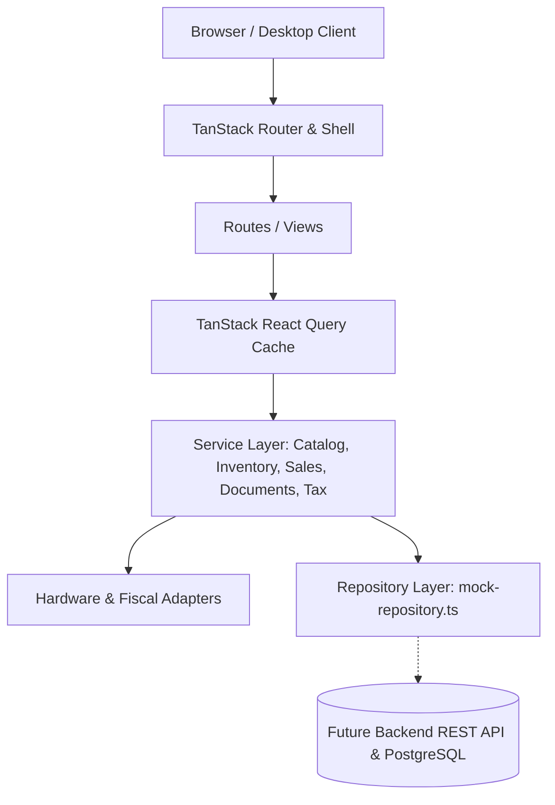
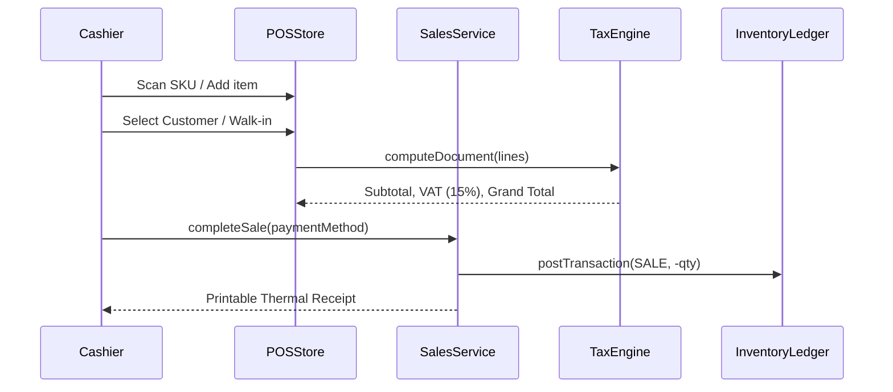
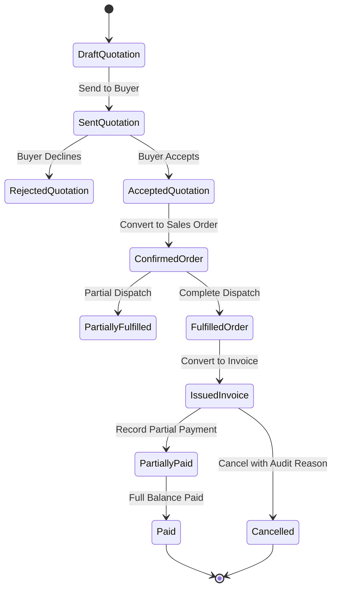

# System Architecture & Component Design

## 1. High-Level Architecture Overview



The application is structured into four distinct layers:

1. **Presentation Layer (`src/routes`, `src/components`)**:
   - Manages UI rendering, responsive grid layouts, and user interactions.
   - Guarded by `<AppLayout permission="...">` which checks permissions before mounting children.
2. **State & Cache Layer (`src/stores`, React Query)**:
   - Server state caching, pagination, optimistic updates, and background refetching.
   - Client POS active transaction, cart lines, and payment drawers managed via Zustand.
3. **Domain & Service Layer (`src/services`, `src/domain`)**:
   - Framework-agnostic business logic, inventory validation, transfer status transitions, and Ethiopian tax computations.
4. **Integration & Adapter Layer (`src/services/hardware.service.ts`, `src/services/fiscal.service.ts`)**:
   - Encapsulates device communication (keyboard barcode wedges, thermal printers, cash drawer relays, and fiscal signatures).

---

## 2. Multi-Tenancy & Branch Isolation

All entities extend the fundamental tenant boundary:

```typescript
interface ScopedEntity {
  id: string;
  tenantId: string;
}
```

- **Tenant Scoping**: All database queries are filtered by `ACTIVE_TENANT_ID`. Users cannot access or view data from another tenant.
- **Branch Scoping**: Users belong to a primary branch. When querying inventory, sales, or shift closures, transactions are partitioned by `branchId`. The top-bar branch switcher allows authorized roles (`owner`, `manager`) to view global aggregated numbers or switch their working context.

---

## 3. Role-Based Access Control (RBAC) Architecture

Access is governed by 5 predefined roles and 44 granular permissions:

| Role | Core Purpose | Access Scope |
| :--- | :--- | :--- |
| **Owner** | Enterprise executive | All permissions across all branches and administration settings |
| **Manager** | Operational branch lead | Full access to sales, inventory, purchasing, staff; restricted system settings |
| **Cashier** | Front-of-store clerk | POS counter sales, receipt printing, customer lookup, cash register |
| **Storekeeper** | Warehouse operator | Stock balances, receiving purchase orders, count sheets, stock transfers |
| **Accountant** | Financial controller | Invoices, payment records, expense tracking, tax reporting, audit logs |

### Permission Check Flow
```
User Action → useSession().can(permission) → If true: Render Action / Route
                                            → If false: Render PermissionDenied or hide button
```

---

## 4. Key Subsystem Workflows

### 4.1 POS Sales & Inventory Deduction


### 4.2 B2B Wholesale Document Lifecycle

