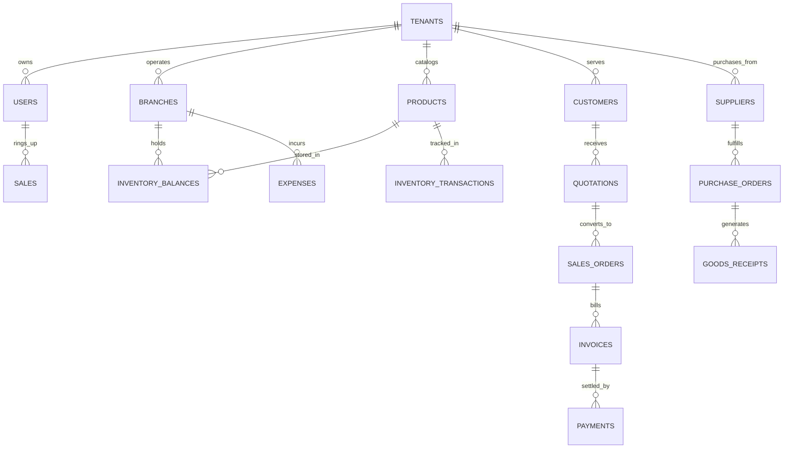

# Database Schema & Entity Relationship Specification

This document maps all TypeScript domain models from `src/domain/types.ts` into a normalized relational schema for PostgreSQL.

---

## 1. Entity Overview Diagram



---

## 2. Core Tables Specification

### 2.1 Multi-Tenancy & Identity

#### `tenants`
| Column | Type | Constraints | Description |
| :--- | :--- | :--- | :--- |
| `id` | `VARCHAR(32)` | `PRIMARY KEY` | Unique tenant ID (e.g., `tenant-abay`) |
| `legal_name` | `VARCHAR(255)` | `NOT NULL` | Registered Ethiopian business entity name |
| `trading_name` | `VARCHAR(255)` | `NOT NULL` | Brand name displayed on receipts |
| `tin` | `VARCHAR(32)` | `NOT NULL` | Ministry of Revenue Tax Identification Number |
| `vat_number` | `VARCHAR(32)` | `NULL` | VAT Registration certificate number |
| `vat_registered`| `BOOLEAN` | `NOT NULL DEFAULT true` | Whether business collects 15% VAT |
| `currency` | `VARCHAR(3)` | `NOT NULL DEFAULT 'ETB'` | Ethiopian Birr |
| `created_at` | `TIMESTAMPTZ` | `NOT NULL DEFAULT NOW()` | Record creation timestamp |

#### `branches`
| Column | Type | Constraints | Description |
| :--- | :--- | :--- | :--- |
| `id` | `VARCHAR(32)` | `PRIMARY KEY` | Branch identifier |
| `tenant_id` | `VARCHAR(32)` | `REFERENCES tenants(id)` | Tenant partition |
| `name` | `VARCHAR(255)` | `NOT NULL` | Branch or warehouse name |
| `code` | `VARCHAR(16)` | `NOT NULL` | Unique location code (e.g., `BOL-01`) |
| `kind` | `VARCHAR(16)` | `NOT NULL` | `'branch'` or `'warehouse'` |
| `address` | `TEXT` | `NOT NULL` | Physical address in Addis Ababa/regions |
| `status` | `VARCHAR(16)` | `NOT NULL DEFAULT 'active'` | `'active'` or `'inactive'` |

#### `users`
| Column | Type | Constraints | Description |
| :--- | :--- | :--- | :--- |
| `id` | `VARCHAR(32)` | `PRIMARY KEY` | User ID |
| `tenant_id` | `VARCHAR(32)` | `REFERENCES tenants(id)` | Tenant partition |
| `name` | `VARCHAR(255)` | `NOT NULL` | Full name |
| `email` | `VARCHAR(255)` | `NOT NULL` | Unique user email |
| `phone` | `VARCHAR(32)` | `NOT NULL` | Contact telephone number |
| `role` | `VARCHAR(32)` | `NOT NULL` | `owner`, `manager`, `cashier`, `storekeeper`, `accountant` |
| `branch_id` | `VARCHAR(32)` | `REFERENCES branches(id)` | Primary assigned branch |
| `status` | `VARCHAR(16)` | `NOT NULL DEFAULT 'active'` | User status |
| `last_active_at`| `TIMESTAMPTZ` | `NULL` | Last session activity |

---

### 2.2 Product Catalog & Inventory

#### `products`
| Column | Type | Constraints | Description |
| :--- | :--- | :--- | :--- |
| `id` | `VARCHAR(32)` | `PRIMARY KEY` | Product ID |
| `tenant_id` | `VARCHAR(32)` | `REFERENCES tenants(id)` | Tenant partition |
| `name` | `VARCHAR(255)` | `NOT NULL` | Product name (e.g. A4 Copy Paper) |
| `sku` | `VARCHAR(64)` | `NOT NULL` | Stock Keeping Unit |
| `barcode` | `VARCHAR(64)` | `NULL` | EAN-13 / UPC barcode string |
| `category_id` | `VARCHAR(32)` | `NOT NULL` | Product category ID |
| `unit_of_measure`| `VARCHAR(32)` | `NOT NULL` | `Pcs`, `Pkt`, `Box`, `Ream`, `Carton` |
| `cost` | `DECIMAL(14,2)`| `NOT NULL` | Supplier purchase cost |
| `retail_price` | `DECIMAL(14,2)`| `NOT NULL` | Front-counter POS price |
| `wholesale_price`| `DECIMAL(14,2)`| `NOT NULL` | Institutional / wholesale bulk price |
| `reorder_level` | `INTEGER` | `NOT NULL DEFAULT 10` | Low stock notification threshold |
| `tax_category_id`| `VARCHAR(32)` | `NOT NULL` | Tax rate category |
| `status` | `VARCHAR(16)` | `NOT NULL DEFAULT 'active'` | `'active'` or `'archived'` |

#### `inventory_balances`
| Column | Type | Constraints | Description |
| :--- | :--- | :--- | :--- |
| `id` | `VARCHAR(32)` | `PRIMARY KEY` | Balance record ID |
| `tenant_id` | `VARCHAR(32)` | `REFERENCES tenants(id)` | Tenant partition |
| `product_id` | `VARCHAR(32)` | `REFERENCES products(id)` | Linked product |
| `location_id` | `VARCHAR(32)` | `REFERENCES branches(id)` | Branch or warehouse location |
| `quantity` | `DECIMAL(14,2)`| `NOT NULL DEFAULT 0` | Current on-hand quantity |
| `average_cost` | `DECIMAL(14,2)`| `NOT NULL` | Weighted average unit cost |

#### `inventory_transactions` (Append-Only Ledger)
| Column | Type | Constraints | Description |
| :--- | :--- | :--- | :--- |
| `id` | `VARCHAR(32)` | `PRIMARY KEY` | Transaction entry ID |
| `tenant_id` | `VARCHAR(32)` | `REFERENCES tenants(id)` | Tenant partition |
| `product_id` | `VARCHAR(32)` | `REFERENCES products(id)` | Linked product |
| `location_id` | `VARCHAR(32)` | `REFERENCES branches(id)` | Location affected |
| `type` | `VARCHAR(32)` | `NOT NULL` | `SALE`, `PURCHASE`, `RETURN`, `TRANSFER_IN`, `TRANSFER_OUT`, `ADJUSTMENT`, `DAMAGE` |
| `quantity` | `DECIMAL(14,2)`| `NOT NULL` | Signed quantity change (+/-) |
| `unit_cost` | `DECIMAL(14,2)`| `NOT NULL` | Valuation at time of entry |
| `reference` | `VARCHAR(128)` | `NOT NULL` | Linked order, receipt or adjustment ref |
| `created_at` | `TIMESTAMPTZ` | `NOT NULL DEFAULT NOW()` | Immutable timestamp |

---

### 2.3 Sales, Invoices & Payments

#### `sales` (POS Transactions)
- `id`, `tenant_id`, `branch_id`, `cashier_id`, `customer_id`, `receipt_number`, `status` (`completed`, `held`, `returned`), `total`, `tax`, `discount`, `payment_method` (`Cash`, `Bank`), `created_at`.
- Lines stored in `sale_lines` table (`sale_id`, `product_id`, `quantity`, `unit_price`, `discount`, `tax_category_id`).

#### `quotations`, `sales_orders`, `invoices`
- Header tables storing reference numbers (`QTN-XXXX`, `SO-XXXX`, `INV-XXXX`), `customer_id`, `branch_id`, `status`, `terms`, `notes`, `created_at`, `due_date`.
- Line items stored in respective `_lines` tables with price, quantity, discount, and tax category references.

#### `payments`
- `id`, `tenant_id`, `invoice_id`, `number`, `amount`, `method` (`Cash`, `Bank`), `bank` (e.g. Commercial Bank of Ethiopia, Awash Bank), `reference`, `branch_id`, `received_by`, `date`.

---

## 3. Recommended Performance Indexes

```sql
-- Multi-tenant partition filters
CREATE INDEX idx_products_tenant_status ON products(tenant_id, status);
CREATE INDEX idx_balances_tenant_loc ON inventory_balances(tenant_id, location_id);
CREATE INDEX idx_ledger_product_loc ON inventory_transactions(tenant_id, product_id, location_id);

-- Sales & document lookups
CREATE INDEX idx_sales_created_at ON sales(tenant_id, branch_id, created_at DESC);
CREATE INDEX idx_invoices_customer ON invoices(tenant_id, customer_id);
CREATE INDEX idx_invoices_status ON invoices(tenant_id, status);
CREATE INDEX idx_payments_invoice ON payments(tenant_id, invoice_id);
```
